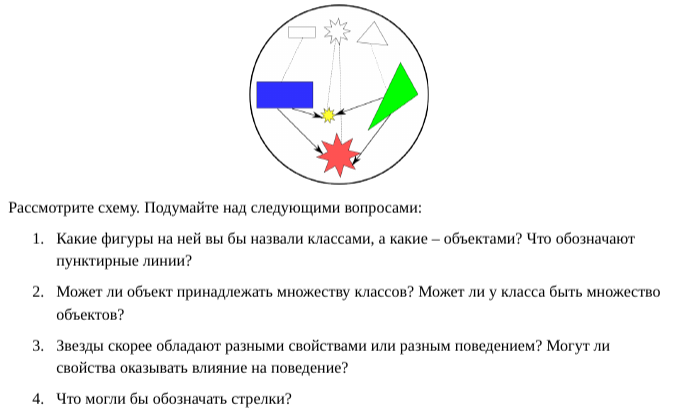

# Лабораторная работа на неделю 1
## **Дисциплина**: Объектно-ориентированное программирование
### Выполнила студентка группы ПИЖ-б-о-23-1(1) Журавлева Софья Витальевна 
**Репозиторий Git:** https://github.com/lookitsssonya/pizh2311_zhuravleva  
**Урок 1**  
  
*Ответ:*
1. Черно-белые фигуры – это классы. Цветные – объекты. Пунктирные линии обозначают принадлежность объекта классу.
2. Обычно в ООП объект не может принадлежать множеству классов. В ООП создается класс, который наследует от множества других классов, а объект порождается от этого класса-коллекции. Можно создать множество объектов одного класса. В этом заключается один из ключевых принципов ООП.
3. Звезды скорее всего обладают разными значениями свойств, а перечень свойств характеристик у всех звезд приблизительно одинаков. Возможности поведения объектов одного класса во многом схожи. Значения свойств влияют на поведение.
4. Стрелки могут обозначать взаимодействие объектов в программе. Поскольку они направлены на звезды, то вероятно треугольник и прямоугольник совершают с ними какие-то действия, воздействуют на них.  


**Урок 2**   
Напишите программу по следующему описанию. Есть класс "Воин". От него создаются два экземпляра-юнита. Каждому устанавливается здоровье в 100 очков. В случайном порядке они бьют друг друга. Тот, кто бьет, здоровья не теряет. У того, кого бьют, оно уменьшается на 20 очков от одного удара. После каждого удара надо выводить сообщение, какой юнит атаковал, и сколько у противника осталось здоровья. Как только у кого-то заканчивается ресурс здоровья, программа завершается сообщением о том, кто одержал победу.  
*Ответ:*  
```python
from random import randint

class Soldier:
    health = 100
    def set_name(self, name):
        self.name = name

    def make_kick(self, enemy):
        enemy.health -= 20
        print(self.name, "бьет", enemy.name)
        print('%s = %d' % (enemy.name, enemy.health))

class Battle:
    result = "Сражения не было"

    def battle(self, u1, u2):
        while u1.health > 0 and u2.health > 0:
            n = randint(1, 2)
            if n == 1:
                u1.make_kick(u2)
            else:
                u2.make_kick(u1)
        if u1.health > u2.health:
            self.result = u1.name + " ПОБЕДИЛ"
        elif u2.health > u1.health:
            self.result = u2.name + " ПОБЕДИЛ"

    def who_win(self):
        print(self.result)

first = Soldier()
second = Soldier()
first.set_name('A')
second.set_name('B')

b = Battle()
b.battle(first, second)
b.who_win()
```

**Урок 3**  
Напишите программу по следующему описанию:  
1. Есть класс Person, конструктор которого принимает три параметра (не учитывая self) - имя, фамилию и квалификацию специалиста. Квалификация имеет значение заданное по-умолчанию, равное единице.
2. У класса Person есть метод, который возвращает строку, включающую в себя всю информацию о сотруднике.
3. Класс Person содержит деструктор, который выводит на экран фразу "До свидания, мистер ... " (вместо троеточия должны выводиться имя и фамилия объекта).
4. В основной ветке программы создайте три объекта класса Person. Посмотрите информацию о сотрудниках и увольте самое слабое звено.
5. В конце программы добавьте функцию input(), чтобы скрипт не завершился сам, пока не будет нажат Enter. Иначе вы сразу увидите как удаляются все объекты при завершении работы программы.  

*Ответ:*  
```python
class Person:
    def __init__(self, n, s, q=1):
        self.name = n
        self.surname = s
        self.skill = q
    def __del__(self):
        print("До свидания, мистер", self.name, self.surname)
    def info(self):
        return "{} {}, {}".format(self.name, self.surname, self.skill)

worker = Person("И", "Котов", 3)
helper = Person("Д", "Мышев", 1)
maker = Person("O", "Рисов", 2)
print(worker.info())
print(helper.info())
print(maker.info())
del helper
print("Конец программы")
input()
```  

**Урок 4**  
Разработайте программу по следующему описанию.  
В некой игре-стратегии есть солдаты и герои. У всех есть свойство, содержащее уникальный номер объекта, и свойство, в котором хранится принадлежность команде. У солдат есть метод "иду за героем", который в качестве аргумента принимает объект типа "герой". У героев есть метод увеличения собственного уровня.  
В основной ветке программы создается по одному герою для каждой команды. В цикле генерируются объекты-солдаты. Их принадлежность команде определяется случайно. Солдаты разных команд добавляются в разные списки.  
Измеряется длина списков солдат противоборствующих команд и выводится на экран. У героя, принадлежащего команде с более длинным списком, поднимается уровень.  
Отправьте одного из солдат первого героя следовать за ним. Выведите на экран идентификационные номера этих двух юнитов.  
*Ответ:*  
```python
from random import randint

class Person:
    count = 0

    def __init__(self, c):
        self.id = Person.count
        Person.count += 1
        self.command = c

class Hero(Person):
    def __init__(self, c):
        Person.__init__(self, c)
        self.level = 1

    def up_level(self):
        self.level += 1

class Soldier(Person):
    def __init__(self, c):
        Person.__init__(self, c)
        self.my_hero = None

    def follow(self, hero):
        self.my_hero = hero.id

h1 = Hero(1)
h2 = Hero(2)

army1 = []
army2 = []

for i in range(20):
    n = randint(1, 2)
    if n == 1:
        army1.append(Soldier(n))
    else:
        army2.append(Soldier(n))

print(len(army1), len(army2))

if len(army1) > len(army2):
    h1.up_level()
elif len(army1) < len(army2):
    h2.up_level()

army1[0].follow(h1)
print(army1[0].id, h1.id)
```

**Урок 5**  
В качестве практической работы попробуйте самостоятельно перегрузить оператор сложения. Для его перегрузки используется метод __add__(). Он вызывается, когда объекты класса, имеющего данный метод, фигурируют в операции сложения, причем с левой стороны. Это значит, что в выражении а + b у объекта а должен быть метод __add__(). Объект b может быть чем угодно, но чаще всего он бывает объектом того же класса. Объект b будет автоматически передаваться в метод __add__() в качестве второго аргумента (первый - self).  
Отметим, в Python также есть правосторонний метод перегрузки сложения - __radd__().  
Согласно полиморфизму ООП, возвращать метод __add__() может что угодно. Может вообще ничего не возвращать, а "молча" вносить изменения в какие-то уже существующие объекты. Допустим, в вашей программе метод перегрузки сложения будет возвращать новый объект того же класса.  
*Ответ:*  
```python
class Rectangle:
    def __init__(self, width, height, sign):
        self.w = int(width)
        self.h = int(height)
        self.s = str(sign)
    def __str__(self):
        rect = []
        for i in range(self.h):
            rect.append(self.s * self.w)
        rect = '\n'.join(rect)
        return rect
    def __add__(self, other):
        return Rectangle(self.w + other.w, self.h + other.h, self.s)

a = Rectangle(4, 2, 'w')
print(a)
b = Rectangle(8, 3, 'z')
print(b)
print(a + b)
print(b + a)
```  
**Урок 6**  
Разработайте класс с "полной инкапсуляцией", доступ к атрибутам которого и изменение данных реализуются через вызовы методов. В объектно-ориентированном программировании принято имена методов для извлечения данных начинать со слова get (взять), а имена методов, в которых свойствам присваиваются значения, - со слова set (установить). Например, getField, setField.  
*Ответ:*  
```python
class Rectangle:
    def __init__(self, width, height):
        self.__w = Rectangle.__test(width)
        self.__h = Rectangle.__test(height)
        print(self)

    def set_width(self, width):
        self.__w = Rectangle.__test(width)

    def set_height(self, height):
        self.__h = Rectangle.__test(height)

    def get_width(self):
        return self.__w

    def get_height(self):
        return self.__h

    def __test(value):
        return abs(value)

    def __str__(self):
        return "Rectangle {0}x{1}".format(self.__w, self.__h)

a = Rectangle(3, 4)
print(a.get_width())
a.set_width(5)
print(a)

b = Rectangle(-2, 4)
```  

**Урок 7**  
Исправьте код так, чтобы у объектов Room были только четыре поля - width, lenght, height и wd. Площади (полная и оклеиваемая) должны вычислять лишь при необходимости путем вызова методов.  
Программа вычисляет площадь под оклейку, но ничего не говорит о том, сколько потребуется рулонов обоев. Добавьте метод, который принимает в качестве аргументов длину и ширину одного рулона, а возвращает количество необходимых, исходя из оклеиваемой площади.  
Разработайте интерфейс программы. Пусть она запрашивает у пользователя данные и выдает ему площадь оклеиваемой поверхности и количество необходимых рулонов.  
*Ответ:*  
```python
import math

class WinDoor:
    def __init__(self, w, h):
        self.square = w * h

class Room:
    def __init__(self, l, w, h):
        self.length = l
        self.width = w
        self.height = h
        self.wd = []

    def add_wd(self, w, h):
        self.wd.append(WinDoor(w, h))

    def full_surface(self):
        return 2 * self.height * (self.length + self.width)

    def work_surface(self):
        new_square = self.full_surface()
        for i in self.wd:
            new_square -= i.square
        return new_square

    def wallpapers(self, l, w):
        return math.ceil(self.work_surface() / (w * l))

print("Размеры помещения:")
l = float(input("Длина - "))
w = float(input("Ширина - "))
h = float(input("Высота - "))
r1 = Room(l, w, h)

flag = input("Есть неоклеиваемая поверхность? (1 - да, 2 - нет) ")
while flag == '1':
    w = float(input("Ширина - "))
    h = float(input("Высота - "))
    r1.add_wd(w, h)
    flag = input("Добавить еще? (1 - да, 2 - нет) ")

print("Размеры рулона:")
l = float(input("Длина - "))
w = float(input("Ширина - "))

print("Площадь оклейки", r1.work_surface())
print("Количество рулонов", r1.wallpapers(l, w))
```  

**Урок 8**  
Напишите класс Snow по следующему описанию.  
В конструкторе класса инициируется поле, содержащее количество снежинок, выраженное целым числом.  
Класс включает методы перегрузки арифметических операторов: _add_() -сложение, _sub_() - вычитание, _mul_() - умножение, _truediv_() - деление. В классе код этих методов должен выполнять увеличение или уменьшение количества снежинок на число n или в n раз. Метод _truediv_() перегружает обычное (), а не целочисленное (//) деление. Однако пусть в методе происходит округление значения до целого числа.  
Класс включает метод makeSnow(), который принимает сам объект и число снежинок в ряду, а возвращает строку вида " ***** \n ***** \n *****... ", где количество снежинок между "\n' равно переданному аргументу, а количество рядов вычисляется, исходя из общего количества снежинок.  
Вызов объекта класса Snow в нотации функции с одним аргументом, должен приводить к перезаписи значения поля, в котором хранится количество снежинок, на переданное в качестве аргумента значение.  
*Ответ:*  
```python
class Snow:
    def __init__(self, qty):
        self.snow = qty
    def __call__(self, qty):
        self.snow = qty
    def __add__(self, n):
        self.snow += n
    def __sub__(self, n):
        self.snow -= n
    def __mul__(self, n):
        self.snow *= n
    def __truediv__(self, n):
        self.snow = round(self.snow / n)
    def makeSnow(self, row):
        qty_row = int(self.snow / row) # количество целых строк
        s = ''
        for i in range(qty_row):
            s += '*' * row + '\n' # добавляется очередная строка
        s += (self.snow - qty_row * row) * '*' # добавляются оставшиеся символы
        if s[-1] == '\n': # если количество снежинок кратно row,
            s = s[:-1] # надо удалить последний переход на новую строку
        return s
```  

**Урок 9**  
Приведенный в конце урока пример плохой. Мы можем менять значения полей dia и h объекта за пределами класса простым присваиванием (например, a.dia = 10). При этом площадь никак не будет пересчитываться. Также мы можем назначить новое значение для площади, как простым присваиванием, так и вызовом функции make_area() с последующим присваиванием. Например, a.area = a.make_area(2, 3). При этом не меняются высота и диаметр.

Защитите код от возможных логических ошибок следующим образом:

Свойствам dia и h объекта по-прежнему можно выполнять присваивание за пределами класса. Однако при этом "за кулисами" происходит пересчет площади, т. е. изменение значения area.
Свойству area нельзя присваивать за пределами класса. Можно только получать его значение.
Подсказка: вспомните про метод setattr(), упомянутый в уроке про инкапсуляцию. 
*Ответ:*  
```python
from math import pi

class Cylinder:
    @staticmethod
    def make_area(d, h):
        circle = pi * d ** 2 / 4
        side = pi * d * h
        return round(circle * 2 + side, 2)

    def __init__(self, diameter, high):
        self.__dict__['dia'] = diameter
        self.__dict__['h'] = high
        self.__dict__['area'] = self.make_area(diameter, high)

    def __setattr__(self, key, value):
        if key == 'dia':
            self.__dict__['dia'] = value
            self.__dict__['area'] = self.make_area(
                self.__dict__['dia'], self.__dict__['h'])
        elif key == 'h':
            self.__dict__['h'] = value
            self.__dict__['area'] = self.make_area(
                self.__dict__['dia'], self.__dict__['h'])
        elif key == 'area':
            print('Нельзя изменять площадь напрямую!')

a = Cylinder(1, 2)
print(a.dia, a.h, a.area)

a.dia = 4.5
a.h = 3.3
print(a.dia, a.h, a.area)

# Не позволено
a.area = 100
print(a.area)
```   

**Урок 10**  
Напишите класс-итератор, объекты которого генерируют случайные числа в количестве и в диапазоне, которые передаются в конструктор. 
*Ответ:*   
```python
from random import random

class RandomIterator:
    def __init__(self, quantity, minimum, maximum):
        self.qty = quantity
        self.low = minimum
        self.high = maximum

    def __iter__(self):
        return self

    def __next__(self):
        if self.qty == 0:
            raise StopIteration
        self.qty -= 1
        return random() * (self.high - self.low) + self.low

rand = RandomIterator(5, 0, 3)

for i in rand:
    print(round(i, 2))
```  

**Урок 11**  
В задании к прошлому уроку требовалось написать класс-итератор, объекты которого генерируют случайные числа в количестве и в диапазоне, которые передаются в конструктор. Напишите выполняющую ту же задачу генераторную функцию. В качестве аргументов она должна принимать количество элементов и диапазон.  
*Ответ:*  
```python
from random import random

def ranrator(qty, minimum, maximum):
    while qty > 0:
        yield random() * (maximum - minimum) + minimum
        qty -= 1

a = ranrator(5, -2, 2)
for i in a:
    print(round(i, 2))
```
