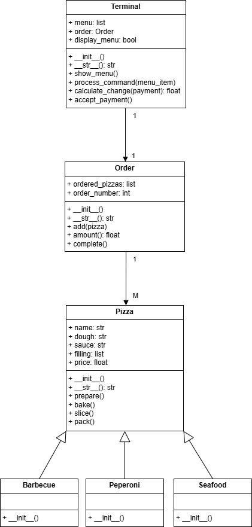

# Лабораторная работа на неделю 3
## **Дисциплина**: Объектно-ориентированное программирование
### Выполнила студентка группы ПИЖ-б-о-23-1(1) Журавлева Софья Витальевна 
**Репозиторий Git:** https://github.com/lookitsssonya/pizh2311_zhuravleva  <br></br>
**Практическая работа**   <br></br>
**Пиццерия**  
Пиццерия предлагает клиентам три вида пиццы: Пепперони, Барбекю и Дары Моря, каждая из которых определяется тестом, соусом и начинкой.  
Требуется спроектировать и реализовать приложение для терминала, позволяющее обеспечить обслуживание посетителей.  
*Дополнительная информация*  
В бизнес-процессе работы пиццерии в контексте задачи можно выделить 3 сущности (объекта):
- Терминал: отвечает за взаимодействие с пользователем:
    - Вывод меню на экран;
    - Прием команд от пользователя (выбор пиццы, подтверждение заказа, оплата и др.);
- Заказ: содержит список заказанных пицц, умеет подсчитывать свою стоимость;
- Пицца: содержит заявленные характеристики пиццы, а также умеет себя подготовить (замесить тесто, собрать ингридиенты и др.), испечь, порезать и упаковать.
Т.к. пиццерия реализует несколько видов пиццы, которые различаются характеристиками, логично будет сделать общий класс Пицца, а в дочерних классах (например, класс ПиццаБарбекю) уточнить характеристики конкретной пиццы. 

Алгоритм работы пользователя с терминалом может выглядеть следующим образом:
1) Терминал отображает список меню.
2) Терминал создает новый заказ.
3) Клиент вводит номер пиццы из меню.
4) Заказ добавляет в список выбранную пиццу.
5) Действия 3-4 повторяются до подтверждения или отмены.
6) Клиент подтверждает заказ (или отменяет).
7) Терминал выставляет счет, отображая информацию о заказе.
8) Терминал принимает оплату.
9) Заказ отдается на выполнение.  

*Ответ:*   
*main.py*
```python
from terminal import Terminal

if __name__ == "__main__":

    terminal1 = Terminal()
    print(terminal1)
    while True:
        terminal1.show_menu()
        menu_item = input()
        terminal1.process_command(menu_item)
```
*order.py*
```python
import time

class Order:
    """Класс Order содержит информацию о заказе."""

    order_counter = 0

    def __init__(self):
        """Конструктор класса."""
        self.ordered_pizzas = []
        Order.order_counter += 1
        self.order_number = Order.order_counter

    def __str__(self) -> str:
        """Вернуть содержимое заказа и его сумму."""
        res = f"Заказ №{self.order_number}\n"
        for i, pizza in enumerate(self.ordered_pizzas, 1):
            res += f"{i}. {pizza}\n"
        res += f"Сумма заказа: {self.amount():.2f} р.\n"
        return res

    def add(self, pizza) -> None:
        """Добавить пиццу в заказ."""
        self.ordered_pizzas.append(pizza)
        print(f"Пицца {pizza.name} добавлена!")

    def amount(self) -> float:
        """Вернуть сумму заказа."""
        return sum(pizza.price for pizza in self.ordered_pizzas)

    def complete(self) -> None:
        """Выполнить заказ."""
        print(f"Заказ поступил на выполнение...")
        for i, pizza in enumerate(self.ordered_pizzas, 1):
            print(f"{i}. {pizza.name}")
            pizza.prepare()
            pizza.bake()
            pizza.slice()
            pizza.pack()
            time.sleep(1)
        print(f"Заказ №{self.order_number} готов! Приятного аппетита!")
```
*pizza.py*
```python
class Pizza:
    """Класс Pizza содержит общие атрибуты для пиццы."""

    def __init__(self):
        """Конструктор класса."""
        self.name = "Заготовка"
        self.dough = "тонкое"
        self.sauce = "кетчуп"
        self.filling = []
        self.price = 0

    def __str__(self) -> str:
        """Вернуть информацию о пицце."""
        return (f"Пицца: {self.name} | Цена: {self.price:.2f} р.\n"
                f"Тесто: {self.dough} Соус: {self.sauce}\n"
                f"Начинка: {', '.join(self.filling)}")

    def prepare(self) -> None:
        """Сообщить о процессе подготовки."""
        print(f"Начинаю готовить пиццу {self.name}")
        print(f"  - замешиваю {self.dough} тесто...")
        print(f"  - добавляю соус: {self.sauce}...")
        print(f"  - и, конечно: {', '.join(self.filling)}...")

    def bake(self) -> None:
        """Сообщить о процессе запекания."""
        print("Выпекаю пиццу... Готово!")

    def slice(self) -> None:
        """Сообщить о процессе нарезки."""
        print("Нарезаю на аппетитные кусочки...")

    def pack(self) -> None:
        """Сообщить о процессе упаковки."""
        print("Упаковываю в фирменную упаковку и готово!")


class Peperoni(Pizza):
    """Класс Peperoni дополняет класс Pizza."""

    def __init__(self):
        super().__init__()
        self.name = "Пепперони"
        self.sauce = "томатный"
        self.filling = ["пепперони", "сыр моцарелла"]
        self.price = 350.00


class Barbecue(Pizza):
    """Класс Barbecue дополняет класс Pizza."""

    def __init__(self):
        super().__init__()
        self.name = "Барбекю"
        self.sauce = "барбекю"
        self.filling = ["бекон", "ветчина", "зелень", "сыр моцарелла"]
        self.price = 450.00


class Seafood(Pizza):
    """Класс Seafood дополняет класс Pizza."""

    def __init__(self):
        super().__init__()
        self.name = "Дары моря"
        self.dough = "пышное"
        self.sauce = "тар-тар"
        self.filling = ["кальмары", "креветки", "мидии", "сыр моцарелла"]
        self.price = 550.00
```
*terminal.py*
```python 
from order import Order
from pizza import Peperoni, Barbecue, Seafood

class Terminal:
    """Класс Terminal обеспечивает взаимодействие с клиентом."""

    COMPANY = "Пиццерия #1"
    COMMAND_CANCELL_ORDER = -1
    COMMAND_CONFIRM_ORDER = 0

    def __init__(self):
        """Конструктор класса."""
        self.menu = [Peperoni(), Barbecue(), Seafood()]
        self.order = None
        self.display_menu = True

    def __str__(self) -> str:
        """Вернуть строковое представление класса."""
        return f"{self.COMPANY}, версия программы 1.0"

    def show_menu(self) -> None:
        """Показать меню."""
        if not self.display_menu:
            return

        print(f"{self.COMPANY}\nДобро пожаловать!\n")
        print("Меню:")
        for i, pizza in enumerate(self.menu, 1):
            print(f"{i}. {pizza}")
        print("Для выбора укажите цифру через <ENTER>.")
        print("Для отмены заказа введите -1")
        print("Для подтверждения заказа введите 0")
        self.display_menu = False

    def process_command(self, menu_item: str) -> None:
        """Обработать действие пользователя."""
        try:
            menu_item = int(menu_item)
            if menu_item == self.COMMAND_CANCELL_ORDER:
                if self.order:
                    print("Заказ отменен.")
                    self.order = None
                else:
                    print("Нет активного заказа для отмены.")
            elif menu_item == self.COMMAND_CONFIRM_ORDER:
                if self.order:
                    print("Заказ подтвержден.")
                    print(self.order)
                    self.accept_payment()
                    self.order.complete()
                    self.order = None
                else:
                    print("Нет активного заказа для подтверждения.")
            elif 1 <= menu_item <= len(self.menu):
                if not self.order:
                    self.order = Order()
                self.order.add(self.menu[menu_item - 1])
            else:
                raise ValueError
        except ValueError:
            print("Не могу распознать команду! Проверьте ввод.")
        except Exception as e:
            print(f"Во время работы терминала произошла ошибка: {e}")

    def calculate_change(self, payment: float) -> float:
        """Вернуть сдачу для 'оплата'."""
        if payment < self.order.amount():
            raise ValueError("Оплата меньше суммы заказа.")
        return payment - self.order.amount()

    def accept_payment(self) -> None:
        """Обработать оплату."""
        try:
            payment = float(input("Введите сумму: "))
            change = self.calculate_change(payment)
            print(f"Вы внесли {payment:.2f} р. Сдача: {change:.2f} р.")
        except Exception as e:
            print(f"Оплата не удалась: {e}")
            raise
```

*Пример вывода:*   

Пиццерия #1, версия программы 1.0   
Пиццерия #1   
Добро пожаловать!   

Меню:
1. Пицца: Пепперони | Цена: 350.00 р.   
Тесто: тонкое Соус: томатный   
Начинка: пепперони, сыр моцарелла   
2. Пицца: Барбекю | Цена: 450.00 р.   
Тесто: тонкое Соус: барбекю   
Начинка: бекон, ветчина, зелень, сыр моцарелла   
3. Пицца: Дары моря | Цена: 550.00 р.    
Тесто: пышное Соус: тар-тар   
Начинка: кальмары, креветки, мидии, сыр моцарелла  <br></br>

Для выбора укажите цифру через ENTER.   
Для отмены заказа введите -1   
Для подтверждения заказа введите 0   

1   
Пицца Пепперони добавлена!   
3   
Пицца Дары моря добавлена!   
0   
Заказ подтвержден.  

Заказ №1   
1. Пицца: Пепперони | Цена: 350.00 р.   
Тесто: тонкое Соус: томатный   
Начинка: пепперони, сыр моцарелла   
2. Пицца: Дары моря | Цена: 550.00 р.   
Тесто: пышное Соус: тар-тар   
Начинка: кальмары, креветки, мидии, сыр моцарелла   
Сумма заказа: 900.00 р.   

Введите сумму: 1000   
Вы внесли 1000.00 р. Сдача: 100.00 р.   
Заказ поступил на выполнение...   
1. Пепперони   
Начинаю готовить пиццу Пепперони   
    - замешиваю тонкое тесто...
    - добавляю соус: томатный...
    - и, конечно: пепперони, сыр моцарелла...<br></br>

Выпекаю пиццу... Готово!   
Нарезаю на аппетитные кусочки...   
Упаковываю в фирменную упаковку и готово!   

2. Дары моря   
Начинаю готовить пиццу Дары моря   
    - замешиваю пышное тесто...   
    - добавляю соус: тар-тар...   
    - и, конечно: кальмары, креветки, мидии, сыр моцарелла...<br></br>

Выпекаю пиццу... Готово!   
Нарезаю на аппетитные кусочки...   
Упаковываю в фирменную упаковку и готово!   
Заказ №1 готов! Приятного аппетита!   

**UML** <br>

