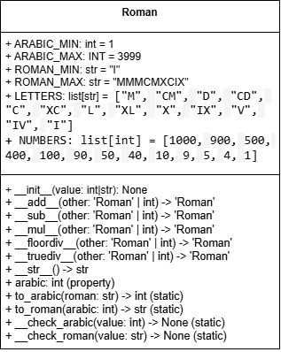

# Лабораторная работа на неделю 3
## **Дисциплина**: Объектно-ориентированное программирование
### Выполнила студентка группы ПИЖ-б-о-23-1(1) Журавлева Софья Витальевна 
**Репозиторий Git:** https://github.com/lookitsssonya/pizh2311_zhuravleva  <br></br>
**Практическая работа**   <br></br>
**Римское число**   
Создайте класс Roman (РимскоеЧисло), представляющий римское число и поддерживающий операции +, -, *, /.   
*Совет*   
При реализации класса следуйте рекомендациям:
- операции +, -, *, / реализуйте как специальные методы (__add__ и др.);
- методы преобразования имеет смысл реализовать как статические методы, позволяя не создавать экземпляр объекта в случае, если необходимо выполнить только преобразование чисел.
При выполнении задания необходимо построить UML-диаграмму классов приложения.   

*Ответ:*   
*main.py*
```python
from roman import Roman

if __name__ == "__main__":
    # Пример использования
    r1 = Roman("X")  # Римское число X (10)
    r2 = Roman(5)    # Арабское число 5 (V)

    print("       Числа:", r1, r2, r1.arabic, r2.arabic)
    # Результат: Числа: X V 10 5

    print("       Сумма:", r1 + r2)  # 10 + 5 = 15 (XV)
    # Результат: Сумма: XV

    print("    Разность:", r1 - r2)  # 10 - 5 = 5 (V)
    # Результат: Разность: V

    print("Произведение:", r1 * r2)  # 10 * 5 = 50 (L)
    # Результат: Произведение: L

    print("     Частное:", r1 // r2)  # 10 // 5 = 2 (II)
    # Результат: Частное: II

    print("\nПреобразование без создания объекта:")
    print(2016, "=", Roman.to_roman(2016))  # 2016 = MMXVI
    # Результат: 2016 = MMXVI

    print("MMXVI", "=", Roman.to_arabic("MMXVI"))  # MMXVI = 2016
    # Результат: MMXVI = 2016
```
*roman.py*
```python
class Roman:
    """Класс Roman реализует работу с римскими числами.

    Алгоритм: http://math.hws.edu/eck/cs124/javanotes7/c8/ex3-ans.html.

    Внутри класс работает с обычными арабскими числами (int),
    которые преобразуются в римские при необходимости (например, при выводе).

    Ключевой атрибут: self._arabic (арабское число).

    Ограничения: число должно быть в пределах [1; 3999].
    """

    ARABIC_MIN: int = 1
    ARABIC_MAX: int = 3999
    ROMAN_MIN: str = "I"
    ROMAN_MAX: str = "MMMCMXCIX"

    LETTERS: list[str] = ["M", "CM", "D", "CD", "C", "XC", "L", "XL", "X", "IX", "V", "IV", "I"]
    NUMBERS: list[int] = [1000, 900, 500, 400, 100, 90, 50, 40, 10, 9, 5, 4, 1]

    def __init__(self, value: int | str) -> None:
        """Инициализация класса.

        Параметры:
            value (str): римское число, например, X.
                или
            value (int): арабское число, например, 5.
                или
            value (другой тип):  возбудить исключение TypeError.
        """
        if not isinstance(value, (int, str)):
            raise TypeError(f"Не могу создать римское число из {type(value)}")

        if isinstance(value, int):
            self.__check_arabic(value)
            self._arabic: int = value
        elif isinstance(value, str):
            self._arabic: int = self.to_arabic(value)

    def __add__(self, other: 'Roman' | int) -> 'Roman':
        """Создает новый объект как сумму 'self' и 'other'.

        Параметры:
            other (Roman): ...
                или
            other (int): арабское число, добавить к self.
                или
            other (другой тип):  возбудить исключение TypeError.
        """
        if isinstance(other, Roman):
            return Roman(self._arabic + other._arabic)
        elif isinstance(other, int):
            return Roman(self._arabic + other)
        else:
            raise TypeError(f"Не могу прибавить {type(other)} к Roman")

    def __sub__(self, other: 'Roman' | int) -> 'Roman':
        """Создает новый объект как разность self и other.

        Параметры:
            other (Roman): ...
                или
            other (int): арабское число, добавить к self.
                или
            other (другой тип):  возбудить исключение TypeError.
        """
        if isinstance(other, Roman):
            return Roman(self._arabic - other._arabic)
        elif isinstance(other, int):
            return Roman(self._arabic - other)
        else:
            raise TypeError(f"Не могу вычесть {type(other)} из Roman")

    def __mul__(self, other: 'Roman' | int) -> 'Roman':
        """Создает новый объект как произведение self и other.

        Параметры:
            other (Roman): ...
                или
            other (int): арабское число, добавить к self.
                или
            other (другой тип):  возбудить исключение TypeError.
        """
        if isinstance(other, Roman):
            return Roman(self._arabic * other._arabic)
        elif isinstance(other, int):
            return Roman(self._arabic * other)
        else:
            raise TypeError(f"Не могу умножить Roman на {type(other)}")

    def __floordiv__(self, other: 'Roman' | int) -> 'Roman':
        """Создает новый объект как частное self и other.

        Параметры:
            other (Roman): ...
                или
            other (int): арабское число, добавить к self.
                или
            other (другой тип):  возбудить исключение TypeError.
        """
        if isinstance(other, Roman):
            return Roman(self._arabic // other._arabic)
        elif isinstance(other, int):
            return Roman(self._arabic // other)
        else:
            raise TypeError(f"Не могу разделить Roman на {type(other)}")

    def __truediv__(self, other: 'Roman' | int) -> 'Roman':
        """Создает новый объект как частное self и other.

        Параметры:
            other (Roman): ...
                или
            other (int): арабское число, добавить к self.
                или
            other (другой тип):  возбудить исключение TypeError.
        """
        return self.__floordiv__(other)

    def __str__(self) -> str:
        """Возвращает строковое представление класса."""
        return Roman.to_roman(self._arabic)

    @staticmethod
    def __check_arabic(value: int) -> None:
        """Возбуждает исключение ValueError, если 'value' не принадлежит
        [ARABIC_MIN; ARABIC_MAX]."""
        if not Roman.ARABIC_MIN <= value <= Roman.ARABIC_MAX:
            raise ValueError(f"Число {value} не входит в допустимый диапазон [{Roman.ARABIC_MIN}; {Roman.ARABIC_MAX}]")

    @staticmethod
    def __check_roman(value: str) -> None:
        """Возбуждает исключение ValueError, если 'value' содержит
        недопустимые символы (не входящие в LETTERS)."""
        for char in value:
            if char not in Roman.LETTERS:
                raise ValueError(f"Недопустимый символ '{char}' в римском числе")

    @property
    def arabic(self) -> int:
        """Возвращает арабское представление числа."""
        return self._arabic

    @staticmethod
    def to_arabic(roman: str) -> int:
        """Преобразовывает римское число 'roman' в арабское.

        Параметры:
            roman (str): римское число, например, "X".

        Возвращает:
            int: арабское число.
        """
        def letter_to_number(letter: str) -> int:
            """Возвращает арабское значение римской цифры 'letter'.
            Регистр не учитывается."""
            return Roman.NUMBERS[Roman.LETTERS.index(letter)]

        Roman.__check_roman(roman)

        i: int = 0  # Позиция в строке roman
        value: int = 0  # Преобразованное число

        while i < len(roman):
            number: int = letter_to_number(roman[i])
            i += 1

            if i == len(roman):
                value += number
            else:
                next_number: int = letter_to_number(roman[i])
                if next_number > number:
                    value += next_number - number
                    i += 1
                else:
                    value += number

        Roman.__check_arabic(value)
        return value

    @staticmethod
    def to_roman(arabic: int) -> str:
        """Преобразовывает арабское число 'arabic' в римское.

        Параметры:
            arabic (int): арабское число, например, 5.

        Возвращает:
            str: римское число.
        """
        Roman.__check_arabic(arabic)

        roman: str = ""
        n: int = arabic

        for i, number in enumerate(Roman.NUMBERS):
            while n >= number:
                roman += Roman.LETTERS[i]
                n -= Roman.NUMBERS[i]

        return roman
```
Пример вывода:   

Числа: X V 10 5   
Сумма: XV   
Разность: V   
Произведение: L   
Частное: II   
Преобразование без создания объекта:   
2016 = MMXVI   
MMXVI = 2016   

**UML** <br>
