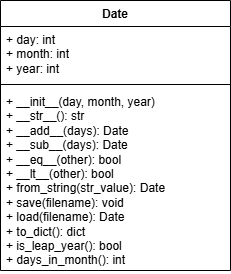

# Лабораторная работа на неделю 4
## **Дисциплина**: Объектно-ориентированное программирование
### Выполнила студентка группы ПИЖ-б-о-23-1(1) Журавлева Софья Витальевна 
**Репозиторий Git:** https://github.com/lookitsssonya/pizh2311_zhuravleva  <br></br>
**Практическая работа**   <br></br>
**Вариант 9** <br></br>
**Простой класс** <br></br> 
Наименование Date, описание Дата

Прежде чем перейти к написанию кода:
- Изучите предметную область объекта и доступные операции;
- Для каждого поля и метода продумайте его область видимости, а также необходимость использования свойств.
При реализации класс должен содержать:
- специальные методы:
    - __init__(self, ....) - инициализация с необходимыми параметрами;
    - __str__(self) - представление объекта в удобном для человека виде;
    - Специальные методы для возможности сложения, разности и прочих операций, которые класс должен поддерживать.
- методы класса:
    -from_string(cls, str_value) - создает объект на основании строки str_value.
- поля, методы и свойства:
    - поля необходимые для выбранного класса;
    - метод save(self, filename) - сохраняет объект в json-файл filename;
    - метод load(self, filename) - загружает объект из json-файла filename;
    - прочие методы (не менее 3х) и свойства, выявленные на этапе изучения класса.

Реализуйте класс в отдельном модуле, а также создайте main.py, который бы тестировал все его возможности.   
При выполнении задания необходимо построить uml-диаграмму классов приложения.  

*Ответ:*   
*main.py*
```python
from date import Date

# Создание объекта Date
date1 = Date(15, 10, 2023)
print(f"Дата 1: {date1}")

# Добавление дней
date2 = date1 + 10
print(f"Дата 1 + 10 дней: {date2}")

# Вычитание дней
date3 = date2 - 5
print(f"Дата 2 - 5 дней: {date3}")

# Сравнение дат
print(f"Дата 1 == Дата 3: {date1 == date3}")
print(f"Дата 1 < Дата 3: {date1 < date3}")

# Создание объекта из строки
date4 = Date.from_string("01.01.2024")
print(f"Дата из строки: {date4}")

# Сохранение и загрузка из JSON
date1.save("date1.json")
loaded_date = Date.load("date1.json")
print(f"Загруженная дата: {loaded_date}")

# Дополнительные методы
print(f"Високосный ли год: {date1.is_leap_year()}")
print(f"Количество дней в месяце: {date1.days_in_month()}")
```
*date.py*
```python
import json
from datetime import datetime, timedelta

class Date:
    """Класс для работы с датами.

    Поля:
      - day (int): день месяца;
      - month (int): месяц;
      - year (int): год.

    Методы:
      - _validate_date(): проверяет корректность даты;
      - __str__(): возвращает строковое представление даты;
      - __add__(days): добавляет дни к текущей дате;
      - __sub__(days): вычитает дни из текущей даты;
      - __eq__(other): сравнивает две даты на равенство;
      - __lt__(other): сравнивает две даты на "меньше";
      - from_string(str_value): создает объект Date из строки;
      - save(filename): сохраняет объект в JSON-файл;
      - load(filename): загружает объект из JSON-файла;
      - to_dict(): возвращает словарь с данными объекта;
      - is_leap_year(): проверяет, является ли год високосным;
      - days_in_month(): возвращает количество дней в текущем месяце.
    """

    def __init__(self, day: int, month: int, year: int):
        """Инициализирует объект Date.

        Аргументы:
          - day (int): день месяца;
          - month (int): месяц;
          - year (int): год.
        """
        self.day = day
        self.month = month
        self.year = year
        self._validate_date()

    def _validate_date(self) -> None:
        """Проверяет корректность даты.

        Вызывает ValueError, если дата некорректна.
        """
        if not (1 <= self.day <= 31):
            raise ValueError("День должен быть между 1 и 31")
        if not (1 <= self.month <= 12):
            raise ValueError("Месяц должен быть между 1 и 12")
        if self.year < 1:
            raise ValueError("Год должен быть положительным числом")

    def __str__(self) -> str:
        """Возвращает строковое представление даты в формате 'дд.мм.гггг'."""
        return f"{self.day:02d}.{self.month:02d}.{self.year:04d}"

    def __add__(self, days: int) -> "Date":
        """Добавляет дни к текущей дате.

        Аргументы:
          - days (int): количество дней для добавления.

        Возвращает:
          - Date: новая дата после добавления дней.
        """
        dt = datetime(self.year, self.month, self.day) + timedelta(days=days)
        return Date(dt.day, dt.month, dt.year)

    def __sub__(self, days: int) -> "Date":
        """Вычитает дни из текущей даты.

        Аргументы:
          - days (int): количество дней для вычитания.

        Возвращает:
          - Date: новая дата после вычитания дней.
        """
        return self.__add__(-days)

    def __eq__(self, other: "Date") -> bool:
        """Сравнивает две даты на равенство.

        Аргументы:
          - other (Date): другая дата для сравнения.

        Возвращает:
          - bool: True, если даты равны, иначе False.
        """
        return self.day == other.day and self.month == other.month and self.year == other.year

    def __lt__(self, other: "Date") -> bool:
        """Сравнивает две даты на "меньше".

        Аргументы:
          - other (Date): другая дата для сравнения.

        Возвращает:
          - bool: True, если текущая дата меньше другой, иначе False.
        """
        return (self.year, self.month, self.day) < (other.year, other.month, other.day)

    @classmethod
    def from_string(cls, str_value: str) -> "Date":
        """Создает объект Date из строки в формате 'дд.мм.гггг'.

        Аргументы:
          - str_value (str): строка с датой.

        Возвращает:
          - Date: объект Date.
        """
        day, month, year = map(int, str_value.split('.'))
        return cls(day, month, year)

    def save(self, filename: str) -> None:
        """Сохраняет объект в JSON-файл.

        Аргументы:
          - filename (str): имя файла для сохранения.
        """
        with open(filename, 'w') as file:
            json.dump(self.to_dict(), file)

    @classmethod
    def load(cls, filename: str) -> "Date":
        """Загружает объект из JSON-файла.

        Аргументы:
          - filename (str): имя файла для загрузки.

        Возвращает:
          - Date: объект Date.
        """
        with open(filename, 'r') as file:
            data = json.load(file)
        return cls(data['day'], data['month'], data['year'])

    def to_dict(self) -> dict[str, int]:
        """Возвращает словарь с данными объекта.

        Возвращает:
          - dict[str, int]: словарь с ключами 'day', 'month', 'year'.
        """
        return {'day': self.day, 'month': self.month, 'year': self.year}

    def is_leap_year(self) -> bool:
        """Проверяет, является ли год високосным.

        Возвращает:
          - bool: True, если год високосный, иначе False.
        """
        if (self.year % 4 == 0 and self.year % 100 != 0) or (self.year % 400 == 0):
            return True
        return False

    def days_in_month(self) -> int:
        """Возвращает количество дней в текущем месяце.

        Возвращает:
          - int: количество дней в месяце.
        """
        if self.month == 2:
            return 29 if self.is_leap_year() else 28
        elif self.month in [4, 6, 9, 11]:
            return 30
        else:
            return 31
```
Пример вывода:   <br></br>
Дата 1: 15.10.2023   
Дата 1 + 10 дней: 25.10.2023   
Дата 2 - 5 дней: 20.10.2023   
Дата 1 == Дата 3: False   
Дата 1 < Дата 3: True   
Дата: 01.01.2024   
Загруженная дата: 15.10.2023   
Високосный ли год: False   
Количество дней в месяце: 31   

**UML** <br>
