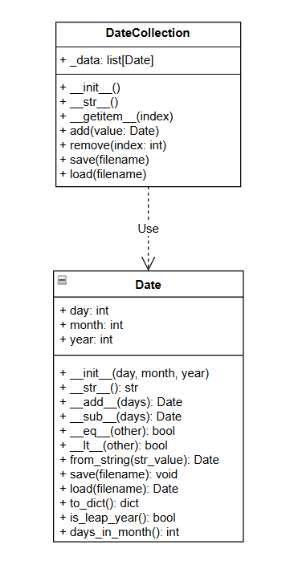

# Лабораторная работа на неделю 5
## **Дисциплина**: Объектно-ориентированное программирование
### Выполнила студентка группы ПИЖ-б-о-23-1(1) Журавлева Софья Витальевна 
**Репозиторий Git:** https://github.com/lookitsssonya/pizh2311_zhuravleva  <br></br>
**Практическая работа**   <br></br>
**Вариант 9** <br></br>
Cоздайте класс-контейнер, который будет содержать набор объектов из предыдущей задачи. Например класс VectorCollection будет содержать объекты класса Vector. Для класса контейнера предусмотрите:
- специальные методы:   
    - __init__(self, ...) - инициализация с необходимыми параметрами
    - __str__(self) - представление объекта в удобном для человека виде
    - __getitem__() - индексация и срез для класса-контейнера   
- поля, методы и свойства:
    - поле _data - содержит набор данных
    - метод add(self, value) - добавляет элемент value в контейнер
    - метод remove(self, index) - удаляет элемент из контейнера по индексу index
    - метод save(self, filename) - сохраняет объект в json-файл filename
    - метод load(self, filename) - загружает объект из json-файла filename  

При выполнении задания необходимо построить диаграмму классов uml.

*Ответ:*   
*main.py*   
```python
from DateCollection import DateCollection
from date import Date

if __name__ == "__main__":
    
    collection = DateCollection()

    date1 = Date(15, 10, 2023)
    date2 = Date(25, 12, 2021)
    date3 = Date(30, 11, 2024)
    
    collection.add(date1)
    collection.add(date2)
    collection.add(date3)

    print("Содержимое коллекции")
    print(collection)  

    print("\nУдаление элемента")
    collection.remove(1)
    print(collection)
    
    print("\nСохранение коллекции в файл JSON")
    collection.save("dates.json")

    print("\nСоздание новой коллекции и загрузка из файла JSON")
    new_collection = DateCollection()
    new_collection.load("dates.json")
    print(new_collection)
```   
*DateCollection.py*   
```python
import json
from date import Date

class DateCollection:
    """Класс-контейнер для хранения и управления набором объектов Date.

    Поля:
      - _data (list[Date]): список объектов Date.

    Методы:
      - __init__(): инициализирует контейнер;
      - __str__(): возвращает строковое представление контейнера;
      - __getitem__(): позволяет индексировать и срезать контейнер;
      - add(): добавляет объект Date в контейнер;
      - remove(): удаляет объект Date из контейнера по индексу;
      - save(): сохраняет контейнер в JSON-файл;
      - load(): загружает контейнер из JSON-файла.
    """

    def __init__(self):
        """Инициализирует контейнер с пустым списком объектов Date."""
        self._data = []  # Инициализация пустого списка для хранения объектов Date

    def __str__(self):
        """Возвращает строковое представление контейнера в виде списка дат."""
        return "[" + ", ".join(str(date) for date in self._data) + "]"  # Преобразуем список дат в строку

    def __getitem__(self, index):
        """Позволяет индексировать и срезать контейнер.

        Аргументы:
          - index (int или slice): индекс или срез для доступа к элементам.

        Возвращает:
          - Date или list[Date]: объект Date или список объектов Date.
        """
        return self._data[index]  # Возвращаем элемент или срез списка

    def add(self, value: Date):
        """Добавляет объект Date в контейнер.

        Аргументы:
          - value (Date): объект Date для добавления.
        """
        self._data.append(value)  # Добавляем объект Date в список

    def remove(self, index: int):
        """Удаляет объект Date из контейнера по индексу.

        Аргументы:
          - index (int): индекс элемента для удаления.
        """
        del self._data[index]  # Удаляем элемент по индексу

    def save(self, filename: str):
        """Сохраняет контейнер в JSON-файл.

        Аргументы:
          - filename (str): имя файла для сохранения.
        """
        with open(filename, 'w') as file:
            # Преобразуем список объектов Date в список словарей и сохраняем в JSON
            json.dump([date.to_dict() for date in self._data], file)

    def load(self, filename: str):
        """Загружает контейнер из JSON-файла.

        Аргументы:
          - filename (str): имя файла для загрузки.
        """
        with open(filename, 'r') as file:
            # Загружаем список словарей из JSON и преобразуем их в объекты Date
            data = json.load(file)
            self._data = [Date.from_string(f"{d['day']}.{d['month']}.{d['year']}") for d in data]
```
Пример использования:   
Содержимое коллекции   
[15.10.2023, 25.12.2021, 30.11.2024]

Удаление элемента   
[15.10.2023, 30.11.2024]

Сохранение коллекции в файл JSON

Создание новой коллекции и загрузка из файла JSON         
[15.10.2023, 30.11.2024]

**UML** <br>

