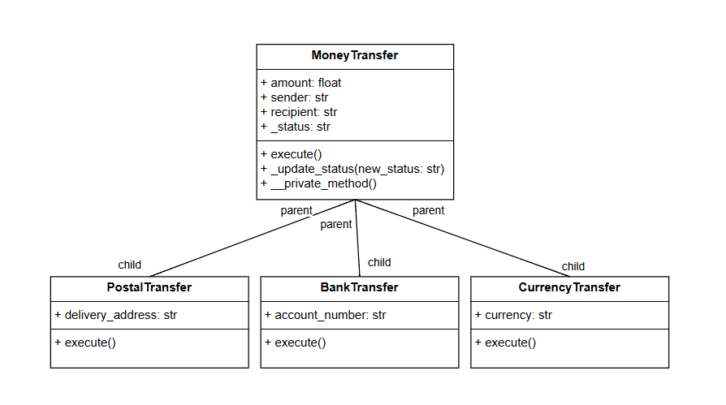

# Лабораторная работа на неделю 5
## **Дисциплина**: Объектно-ориентированное программирование
### Выполнила студентка группы ПИЖ-б-о-23-1(1) Журавлева Софья Витальевна 
**Репозиторий Git:** https://github.com/lookitsssonya/pizh2311_zhuravleva  <br></br>
**Практическая работа**   <br></br>
**Вариант 9** <br></br>
Выберите класс под номером № (Таблица 2), где № — Ваш порядковый номер в журнале. При превышении порядкового номера отчет ведется сначала по циклу.    
Далее:

- выстройте классы в иерархию, продумайте их общие и отличительные характеристики и действия;
- добавьте собственную реализацию методов базового класса в каждый из классов, предусмотрев:
    - необходимые параметры для базовых методов (например, в метод воспроизведения в DVD-плеере можно передать абстрактный DVD-диск);
    - необходимые поля для работы базовых методов (например, при остановке DVD-плеера имеет смысл сохранить текущую позицию воспроизведения); классы должны содержать как минимум по одному общедоступному, не общедоступному и закрытому полю/методу;
    - вывод на экран информации о работе метода (например, вызов метода остановки в DVD-плеере должен сообщать на экране, что плеер установлен на определённую позицию).
- по желанию добавьте собственные методы в классы иерархии.

Реализуйте все классы в отдельном модуле, а также создайте файл main.py, который будет тестировать все его возможности.
По согласованию иерархия может быть расширена или выбрана отдельная тема для данной задачи.
При выполнении задания необходимо построить UML-диаграмму классов приложения.

*Ответ:*   
*main.py*   
```python
from transaction import MoneyTransfer, PostalTransfer, BankTransfer, CurrencyTransfer

if __name__ == "__main__":
    
    print("===Тестируем Денежный Перевод===")
    money_transfer = MoneyTransfer(3000, "Иван Иванов", "Петр Петров")
    money_transfer.execute()
    
    print("\n===Тестируем Почтовый Перевод===")
    postal = PostalTransfer(1000, "Петр Сидоров", "Михаил Круглов", "ул. Ленина, 13")
    postal.execute()
    
    print("\n===Тестируем Банковский Перевод===")
    bank = BankTransfer(2000, "Ирина Бондаренко", "Александр Александров", "1234567890")
    bank.execute()
    bank._update_status("Отменен")
    
    print("\n===Тестируем Валютный Перевод===")
    currency = CurrencyTransfer(500, "Светлана Иванова", "Игорь Никитин", "RUB")
    currency.execute()
```   
*transaction.py*   
```python
class MoneyTransfer:
    """
    Базовый класс для денежных переводов.
    
    Атрибуты:
        amount (float): Сумма перевода.
        sender (str): Имя отправителя.
        recipient (str): Имя получателя.
        _status (str): Статус перевода (защищенное поле).
    """
    
    def __init__(self, amount, sender, recipient):
        """
        Инициализация базового класса MoneyTransfer.
        
        Аргументы:
            amount (float): Сумма перевода.
            sender (str): Имя отправителя.
            recipient (str): Имя получателя.
        """
        self.amount = amount
        self.sender = sender
        self.recipient = recipient
        self._status = "Инициализирован"  # Защищенное поле

    def execute(self):
        """
        Выполняет перевод и обновляет статус.
        """
        self._status = "Выполнен"
        print(f"Перевод на сумму {self.amount} от {self.sender} к {self.recipient} выполнен.")

    def _update_status(self, new_status):
        """
        Обновляет статус перевода (защищенный метод).
        
        Аргументы:
            new_status (str): Новый статус перевода.
        """
        self._status = new_status
        print(f"Статус перевода изменен на: {new_status}")

    def __private_method(self):
        """
        Закрытый метод, недоступный для внешнего использования.
        """
        print("Вызван закрытый метод __private_method.")


class PostalTransfer(MoneyTransfer):
    """
    Класс для почтовых переводов.
    
    Атрибуты:
        delivery_address (str): Адрес доставки перевода.
    """
    
    def __init__(self, amount, sender, recipient, delivery_address):
        """
        Инициализация класса PostalTransfer.
        
        Аргументы:
            amount (float): Сумма перевода.
            sender (str): Имя отправителя.
            recipient (str): Имя получателя.
            delivery_address (str): Адрес доставки перевода.
        """
        super().__init__(amount, sender, recipient)
        self.delivery_address = delivery_address

    def execute(self):
        """
        Выполняет почтовый перевод и выводит информацию о доставке.
        """
        super().execute()
        print(f"Почтовый перевод будет доставлен по адресу: {self.delivery_address}")


class BankTransfer(MoneyTransfer):
    """
    Класс для банковских переводов.
    
    Атрибуты:
        account_number (str): Номер счета получателя.
    """
    
    def __init__(self, amount, sender, recipient, account_number):
        """
        Инициализация класса BankTransfer.
        
        Аргументы:
            amount (float): Сумма перевода.
            sender (str): Имя отправителя.
            recipient (str): Имя получателя.
            account_number (str): Номер счета получателя.
        """
        super().__init__(amount, sender, recipient)
        self.account_number = account_number

    def execute(self):
        """
        Выполняет банковский перевод и выводит информацию о счете.
        """
        super().execute()
        print(f"Банковский перевод выполнен на счет: {self.account_number}")


class CurrencyTransfer(MoneyTransfer):
    """
    Класс для валютных переводов.
    
    Атрибуты:
        currency (str): Валюта перевода.
    """
    
    def __init__(self, amount, sender, recipient, currency):
        """
        Инициализация класса CurrencyTransfer.
        
        Аргументы:
            amount (float): Сумма перевода.
            sender (str): Имя отправителя.
            recipient (str): Имя получателя.
            currency (str): Валюта перевода.
        """
        super().__init__(amount, sender, recipient)
        self.currency = currency

    def execute(self):
        """
        Выполняет валютный перевод и выводит информацию о валюте.
        """
        super().execute()
        print(f"Валютный перевод выполнен в валюте: {self.currency}")

```
Пример использования:   
===Тестируем Денежный Перевод===   
Перевод на сумму 3000 от Иван Иванов к Петр Петров выполнен.

===Тестируем Почтовый Перевод===    
Перевод на сумму 1000 от Петр Сидоров к Михаил Круглов выполнен.   
Почтовый перевод будет доставлен по адресу: ул. Ленина, 13

===Тестируем Банковский Перевод===   
Перевод на сумму 2000 от Ирина Бондаренко к Александр Александров выполнен.   
Банковский перевод выполнен на счет: 1234567890          
Статус перевода изменен на: Отменен   

===Тестируем Валютный Перевод===   
Перевод на сумму 500 от Светлана Иванова к Игорь Никитин выполнен.   
Валютный перевод выполнен в валюте: RUB

**UML** <br>


